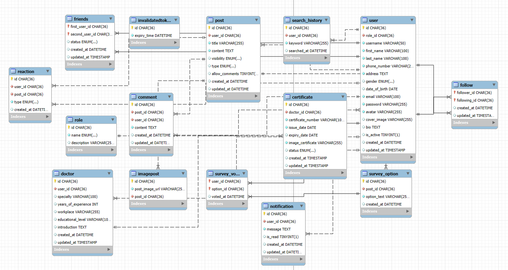
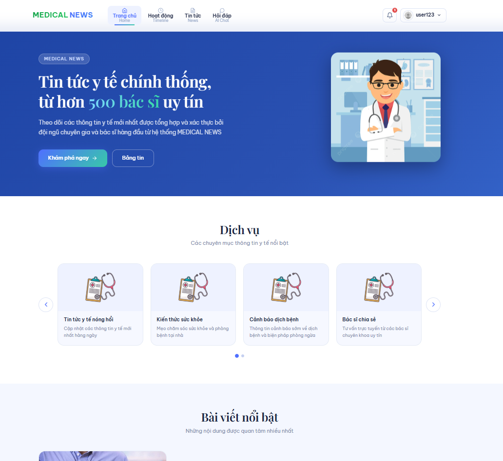
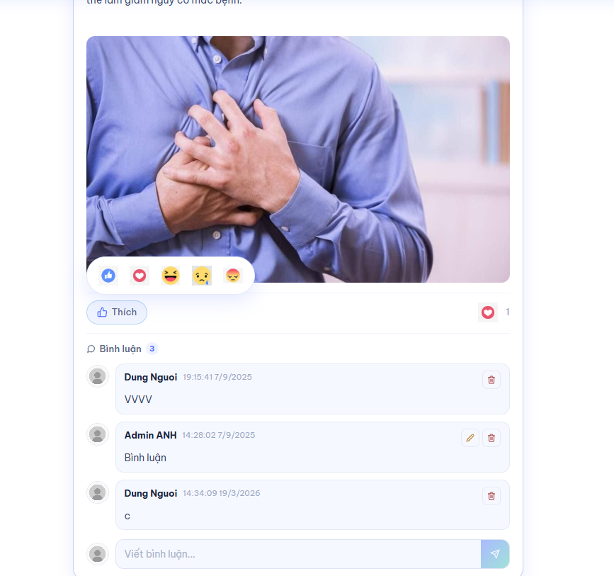
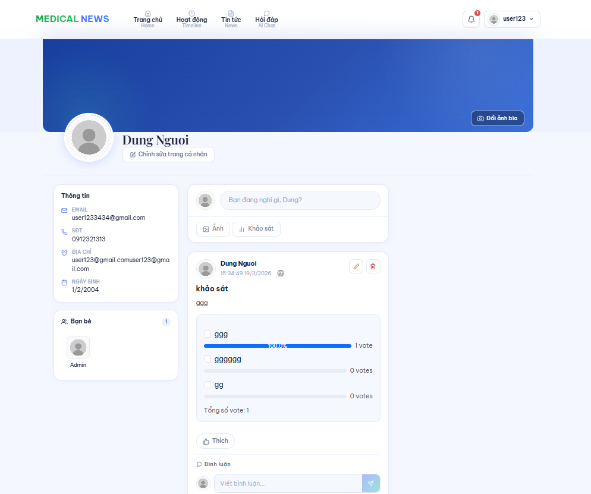
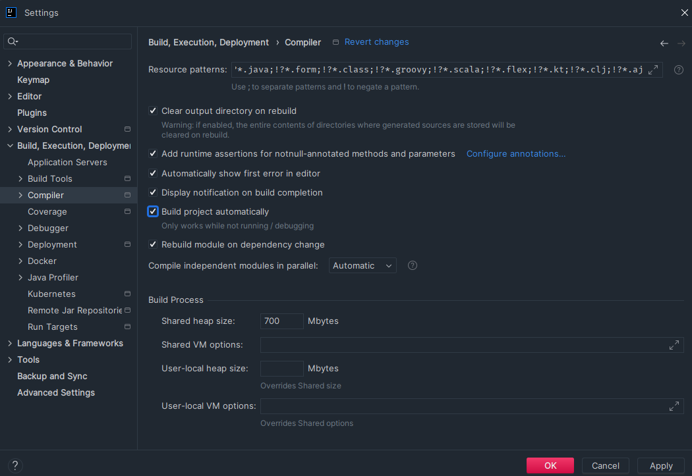
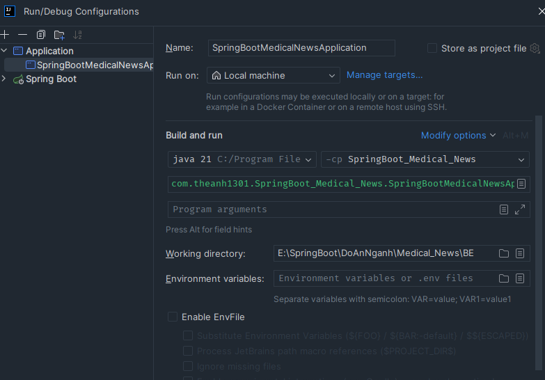

<h1>TOPIC : MEDICAL NEWS SYSTEM INTEGRATED WITH CHATBOT TO CONSULT COMMON DISEASES</h1>

<h1>Link report </h1>
<a href="https://drive.google.com/drive/folders/1gRYqlxZ1F99dh48N-4cUAWh_XrExIZ7h?usp=drive_link" alt"Link report">Click here</a>

<h1>📁Requirements for the Medical News System Integrated with Chatbot</h1>
1. General Objective

Develop a medical news system that serves the community.

Integrate social network features and health-supporting utilities for searching and consulting.

2. User Roles

Administrator (Admin)

Manage users, doctors, posts, and system activities.

Approve or remove any content if necessary.

User

Register an account with profile picture.

Access personal profile and timeline.

Doctor

Account created by the Admin.

Required to verify medical license before being allowed to operate on the system.

3. Account and Profile

Every account includes:

A personal profile page.

A timeline to track posted articles.

4. Post and Interaction Features

Users and doctors can:

Create new posts.

Comment and react with emotions (like, haha, heart, sad, angry).

Post owner can:

Lock comments.

Edit or delete their own posts.

Comments can:

Be edited only by the comment’s author.

Be deleted by either the Admin or the comment’s author.

Admin has the right to:

Remove any post if necessary.

5. Search and History

Support searching for:

Users.

Posts.

System stores recent search history and allows users to clear it.

6. Statistics and Analytics

Admin dashboard includes:

Number of users.

Number of posts by year, month, and quarter.

Data presented in visual charts/graphs.

7. Real-time Communication

Chat system: Integrated via Firebase for real-time messaging.

Video call: Implemented using WebRTC.

Social interactions: Add friends, follow users, receive activity notifications.

8. Medical News Integration

System fetches medical news from trusted sources.

News articles are categorized by disease groups.

Users can comment and rate medical news.

9. Chatbot for Health Consultation

Integrated medical chatbot powered by:

RAG model (Retrieval-Augmented Generation).

LangChain + Flask for implementation.

Provides basic consultation for patients before meeting a doctor.

10. Technology Stack

Backend: Spring Boot.

Frontend: ReactJS.

Ensures security, performance, and user experience.

11. Vision

Not only a medical news-sharing platform, but also a community hub for health exchange and comprehensive support.


<h1>📦Database Schema Diagram</h1>



<h1>💻System Architecture</h1>


<h1>RESULT</h1>





# SpringBoot_App

industry project

<h1>SETUP CORE AI</h1>

- Ghi tên file vào trained_file.log khi đã train các file _ lấy các file có tên đánh dấu là đã train

<h2>Anacoda prompt</h2>

```

conda create -n medichatbot python=3.10 -y

conda activate medichatbot

pip install -r requirements.txt

python template.py

add -e .  in requirements.txt  -> nó tìm tập setup.py và chạy

python store_index.py -> create db pine lần đầu

python app.py 


#Chạy cho lần đầu tiên -> python store_index.py

#Chạy mỗi lần để thực hiện gọi đc api -> python app.py 

```

<h1>BE - SPRINGBOOT - SETUP</h1>

```

- run container spring-mysql - từ image mysql-lastest 

- create Application -> for .env 


```

Enable SpringBoot Dev Tool



Ctrl+Shift+A -> registry -> compiler.automake.allow.when.app.running

<h1>Setup -Redis</h1>


CMD
```
RUN DOCKER DESKTOP

docker --version 

docker run --name redis-dev -p 6379:6379 -d redis


add pom.xml

<!-- https://mvnrepository.com/artifact/org.springframework.boot/spring-boot-starter-data-redis -->
<dependency>
    <groupId>org.springframework.boot</groupId>
    <artifactId>spring-boot-starter-data-redis</artifactId>
    <version>3.5.3</version>
</dependency>


<!-- https://mvnrepository.com/artifact/org.springframework.boot/spring-boot-starter-cache -->
<dependency>
    <groupId>org.springframework.boot</groupId>
    <artifactId>spring-boot-starter-cache</artifactId>
    <version>3.5.3</version>
</dependency>

Config -> application.properties 

```




<h1>Front end -REACTJS(TSX) - SETUP</h1>


```
yarn create react-app medical-news --template typescript

yarn start

```

<h1>RUN PROJECT</h1>

```
1. Run Docker -> container : spring-MySQL - lastest  + peerJS

2. BE: Select  SpringBoot_Medical_News  -> Run  :   http://localhost:8080/SpringBoot_Medical_News    (admin - pass:12345678)

3. FE : Select Fe  , cd medical-new : yarn start   || cd medical-new cd function : npm run serve

4. Run chatbot in huggingface


```
